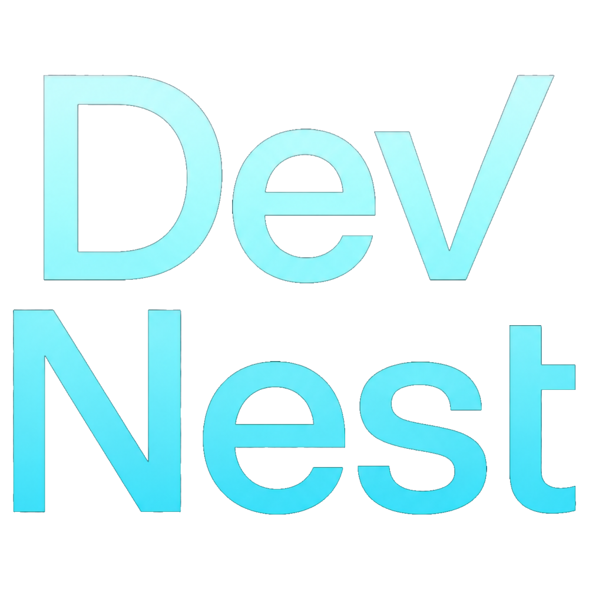

<div align="center">



### Plataforma Web Colaborativa para Equipos de Desarrollo de Software

Encuentra desarrolladores, crea equipos y construye proyectos reales desde una única plataforma. Inspirado en herramientas como GitHub, Trello, Jira y Discord, con una arquitectura moderna orientada a la colaboración.

<p>
  
  
  
  
  
  
  
</p>

</div>

---

# 1. Descripción del proyecto

## Objetivo

Desarrollar una plataforma web profesional donde desarrolladores puedan encontrar colaboradores, formar equipos y desarrollar proyectos reales de forma organizada.

El objetivo no es competir con GitHub ni con LinkedIn, sino ofrecer una plataforma especializada en la creación y gestión de equipos de desarrollo, integrando herramientas de organización, comunicación y seguimiento del trabajo.

Este proyecto servirá como una demostración completa de conocimientos Full Stack utilizando tecnologías utilizadas actualmente en empresas, siguiendo una arquitectura profesional, escalable y mantenible.

---

# 2. Objetivos

- Crear una aplicación Full Stack profesional.
- Aprender ASP.NET Core aplicando buenas prácticas.
- Aprender React + TypeScript.
- Diseñar una arquitectura escalable.
- Implementar autenticación segura.
- Gestionar equipos de desarrollo.
- Gestionar proyectos colaborativos.
- Integrar herramientas modernas.
- Aprender Docker y despliegue.
- Construir un proyecto de alto nivel para portfolio.

---

# 3. Problema que resuelve

Actualmente existen plataformas como GitHub, Discord o Reddit donde los desarrolladores buscan colaboradores, pero ninguna está realmente diseñada para gestionar todo el ciclo de vida de un proyecto colaborativo.

Esta plataforma pretende solucionar problemas como:

- Encontrar personas con tecnologías específicas.
- Formar equipos fácilmente.
- Organizar el trabajo del proyecto.
- Centralizar comunicación y gestión.
- Mostrar experiencia real de los desarrolladores.

---

# 4. Público objetivo

- Estudiantes
- Programadores junior
- Programadores freelance
- Equipos de hackathons
- Startups
- Open Source
- Empresas (futuro)

---

# 5. Stack tecnológico

## Frontend

- React
- TypeScript
- Vite
- Tailwind CSS
- React Router
- TanStack Query
- Shadcn/UI

## Backend

- ASP.NET Core
- Entity Framework Core
- ASP.NET Identity
- JWT Authentication
- SignalR
- FluentValidation
- Swagger

## Base de datos

- PostgreSQL

## DevOps

- Docker
- Docker Compose
- GitHub Actions
- Nginx

---

# 6. Funcionalidades principales

## Usuarios

- Registro
- Login
- Recuperar contraseña
- Verificación por email
- Perfil público
- Portfolio
- Tecnologías
- Experiencia
- Disponibilidad
- Redes sociales

---

## Proyectos

- Crear proyecto
- Editar proyecto
- Eliminar proyecto
- Buscar proyectos
- Filtros
- Tecnologías utilizadas
- Estado del proyecto
- Roles necesarios

---

## Equipos

- Crear equipo
- Solicitudes
- Invitaciones
- Gestión de miembros
- Roles
- Permisos

---

## Gestión del trabajo

- Kanban
- Tareas
- Prioridades
- Issues
- Milestones

---

## Comunicación

- Chat del proyecto
- Mensajes privados
- Notificaciones en tiempo real

---

## Dashboard

- Actividad reciente
- Estadísticas
- Solicitudes
- Proyectos
- Equipos

---

## Perfil profesional

Cada usuario dispondrá de una página pública con:

- Tecnologías
- Proyectos
- Contribuciones
- Valoraciones
- Actividad
- Portfolio

---

# 7. Funcionalidades futuras

- Login con GitHub
- Login con Google
- Integración con GitHub
- Importar repositorios
- Sincronizar commits
- Sincronizar Pull Requests
- Integración con Discord
- Calendario
- Sistema de reputación
- Marketplace de proyectos
- Empresas
- Aplicación móvil

---

# 8. Inteligencia Artificial

La IA no será un simple chatbot.

Su objetivo será ayudar al desarrollador.

Posibles funciones:

- Generar README
- Generar documentación
- Sugerir tecnologías
- Explicar errores
- Recomendar colaboradores
- Resumir reuniones
- Crear roadmap
- Mejorar descripciones

---

# 9. Arquitectura

El proyecto seguirá una arquitectura limpia.

Frontend

↓

API

↓

Application

↓

Domain

↓

Infrastructure

↓

PostgreSQL

Todo el código deberá mantenerse desacoplado y organizado para facilitar el mantenimiento y futuras ampliaciones.

---

# 10. Seguridad

- JWT
- Refresh Tokens
- Hash de contraseñas
- Validaciones
- Rate Limiting
- HTTPS
- Protección XSS
- Protección CSRF
- Protección SQL Injection
- Roles
- Permisos
- Auditoría

---

# 11. Organización del repositorio

```
ProjectForge/

frontend/

backend/

database/

docker/

docs/

scripts/

README.md

LICENSE
```

---

# 12. Roadmap

## Versión 0.1

- Arquitectura
- Configuración inicial
- Base de datos
- Docker
- Autenticación

---

## Versión 0.2

- Usuarios
- Perfiles
- Dashboard

---

## Versión 0.3

- Proyectos
- Equipos
- Solicitudes

---

## Versión 0.4

- Kanban
- Issues
- Gestión del trabajo

---

## Versión 0.5

- Chat
- SignalR
- Notificaciones

---

## Versión 0.6

- IA
- GitHub
- Estadísticas

---

## Versión 1.0

Aplicación completamente funcional y desplegada.

---

# 13. Objetivos de aprendizaje

Este proyecto pretende profundizar en:

## Backend

- ASP.NET Core
- Clean Architecture
- SOLID
- Dependency Injection
- Entity Framework
- APIs REST
- Seguridad
- Testing

## Frontend

- React
- TypeScript
- Gestión de estado
- Componentes reutilizables
- Responsive Design
- Consumo de APIs

## Base de datos

- PostgreSQL
- Relaciones
- Índices
- Migraciones
- Optimización

## DevOps

- Docker
- Docker Compose
- GitHub Actions
- Despliegue
- Nginx

## Arquitectura

- Clean Architecture
- Repository Pattern
- CQRS
- DTO
- Validación
- Logging

---

# 14. Objetivo final

Construir una plataforma moderna y profesional que permita demostrar conocimientos reales de desarrollo Full Stack, arquitectura de software, bases de datos, seguridad, DevOps y buenas prácticas utilizadas en empresas.

Más allá del portfolio, el objetivo es desarrollar una aplicación que pueda evolucionar hasta convertirse en un producto real con usuarios activos y futuras funcionalidades comerciales.
